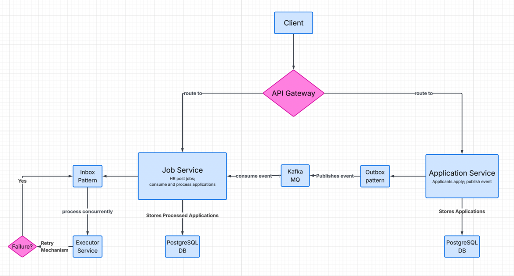

# Event-Driven Concurrent Job Processing System
A production-grade microservices-based job application system built using Spring Boot, Apache Kafka, and PostgreSQL, designed to simulate real-world distributed systems with event-driven architecture, concurrency, and fault tolerance.

## Overview
This system allows:
* Candidates to apply for jobs with resumes 
* HRs to post jobs, process and evaluate applicants
  
The project demonstrates real-world system design patterns like:
* Event-driven architecture 
* Inbox & Outbox patterns 
* Idempotent consumers 
* Retry & failure handling 
* Distributed system coordination

## Architecture

## Services
### 1️⃣ Application Service

Handles candidate-side operations:
* Apply for jobs 
* Upload resume (file handling)
* Validate job existence via Job Service before application submission
* Prevent duplicate applications (pre-check)
* Publishes events to Kafka using Outbox Pattern

### 2️⃣ Job Service

Handles HR-side processing:
* Create and manage jobs 
* Consume job application events 
* Process applications asynchronously 
* Extract resume content 
* Compute ATS score 
* Provide APIs for HR insights (top applicants)

Implements:
* Inbox Pattern 
* Retry mechanism 
* Idempotent event processing 
* Dead Letter Queue (DB-based)

### 3️⃣ Eureka Server

Service discovery using Netflix Eureka

### 4️⃣ API Gateway

Central entry point using Spring Cloud Gateway

## 🔄 Event Flow
1. Candidate applies (Application Service)
2. Application stored and event saved to Outbox table
3. Event published to Kafka by continuous polling Outbox table
4. Job Service consumes event
5. Event stored in Inbox table
6. Worker processes application from inbox table asynchronously using ExecutorService
7. ATS score calculated
8. Application status updated

## APIs
### Job Service
* `POST /jobs/create` - Create a new job posting
* `GET /jobs/` - Get all job postings
* `GET /jobs/{jobId}` - Get job by id
* `GET jobs/1/top-applicants?limit=n` - Get top n applicants for a job based on ATS score
* `GET jobs/1/applicants-above-score?minScore=k` - Get applicants with ATS score greater than or equal to k for a job
### Application Service
* `POST /applications/apply` - Apply for a job with resume upload

## Database Design
### Job Service
* jobs 
* applications 
* inbox_events
### Application Service
* applications 
* outbox_events

## Tech Stack
* Java 17 
* Spring Boot 
* Spring Data JPA 
* Apache Kafka 
* PostgreSQL 
* Spring Cloud (Eureka, Gateway)
* Maven

## Running the Application
### 1️⃣ Start Kafka
* Start Zookeeper & Kafka `docker-compose up -d`
### 2️⃣ Start Services (order matters)
* Eureka Server 
* API Gateway 
* Job Service 
* Application Service
### 3️⃣ Access
* Eureka Dashboard: http://localhost:8761
* API Gateway: http://localhost:8765

## Testing

Use Postman:
* Create Job 
* Apply with resume 
* Check Kafka processing 
* Fetch top applicants

## Author

Thatipalli Manesh

## ⭐ If you like this project

Give it a ⭐ on GitHub!